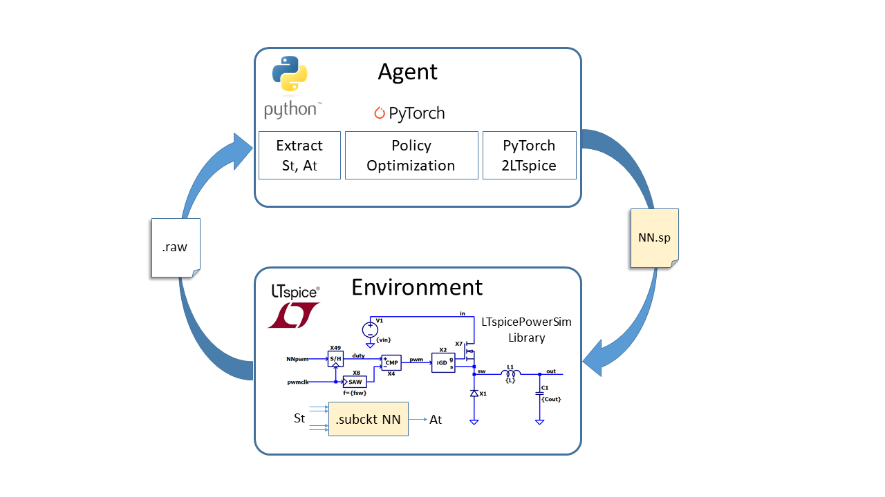
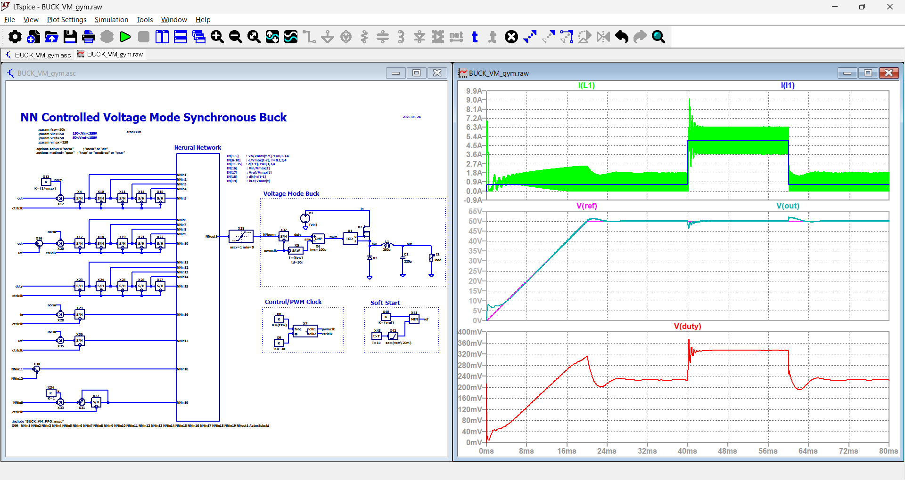

# PyTorch2LTspice

**PyTorch2LTspice** enables the integration of neural networks into circuit simulations by converting PyTorch models into LTspice-compatible behavioral subcircuits (`.subckt`).  
This tool allows deep learning inference—including supervised learning models and reinforcement learning policies—to run directly within LTspice.

By combining with the [LTspicePowerSim](https://github.com/kosokno/LTspicePowerSim.git) environment, users can evaluate neural network behavior across a wide range of power electronics applications, such as DC-DC converters, inverters, and motor drivers.



---

## 📌 Features

- Converts PyTorch `nn.Sequential` models to LTspice-compatible `.subckt` format
- Supports:
  - `nn.Linear`
  - `nn.ReLU`
  - `nn.Sigmoid`
- Outputs a netlist using behavioral voltage sources (`B` elements)
- Auto-generates LTspice node names (`NNIN1`, `NNIN2`, ..., `NNOUT1`)
- Easy integration into LTspice testbenches

---

## 🧠 Motivation

Neural networks trained in Python (with PyTorch) can now be exported and tested directly in LTspice circuit simulations.  
This allows for:
- Closed-loop simulation with NN controllers 
- Verification of inference logic inside switching power supplies
- Observation of behavior under nonlinear and dynamic conditions

---

## ✨ Example

### NN Controlled Voltage Mode Buck (WIP)



---

## 🚀 How to Use

### 1. Define a model in PyTorch

```python
import torch.nn as nn

model = nn.Sequential(
    nn.Linear(20, 32),
    nn.ReLU(),
    nn.Linear(32, 16),
    nn.ReLU(),
    nn.Linear(16, 1)
)
model.eval()
```

### 2. Export as LTspice `.subckt` file

```python
from PyTorch2LTspice import export_model_to_ltspice

export_model_to_ltspice(
    model,
    filename="TEST_MODEL_SUBCKT.SP",
    subckt_name="TESTACTORSUBCKT"
)
```

---

## 📂 Output Example

The resulting LTspice subcircuit will look like:

```
.SUBCKT TESTACTORSUBCKT NNIN1 NNIN2 ... NNIN20 NNOUT1
* LAYER 1: LINEAR
B1_1 L1_1 0 V=V(NNIN1)*(-0.179081)+V(NNIN2)*(-0.068428)+...
...
* ACTIVATION LAYER 1: RELU
B_ACT1_1 L_ACT1_1 0 V=(IF(V(L1_1)>0,V(L1_1),0))
...
B_OUT NNOUT1 0 V=V(L_ACT2_1)
.ENDS TESTACTORSUBCKT
```

You can include it in your LTspice schematic with `.INCLUDE TEST_MODEL_SUBCKT.SP`, and wire it to your simulated environment.

---

## 📎 Dependencies

- Python 3.7+
- PyTorch
- NumPy

Install with:

```bash
pip install torch numpy
```

---

## 📄 License

MIT License

---

## 🧩 Related Projects

- 🔗 [LTspicePowerSim](https://github.com/kosokno/LTspicePowerSim.git):  
  A Simulink-like power electronics simulation environment built on LTspice,

